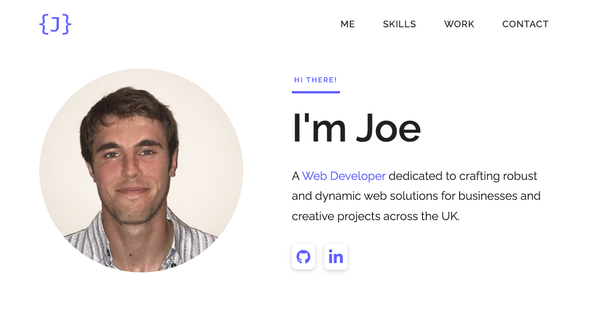

# Joe Leeson

A portfolio showcasing freelance web development projects and skills.



## Tech Stack

- [Bootstrap 5](https://getbootstrap.com)
- [jQuery](https://jquery.com)
- Sass
- [Laravel Mix](https://laravel-mix.com)

## Getting Started

### Prerequisites

- Node.js (v14+)

### Installation

1. Clone the repository
```bash
git clone https://github.com/jaleeson11/joeleeson.git
```

2. Navigate to the project directory
```bash
cd joeleeson
```

3. Install dependencies
```bash
npm install
```

4. Run the development server
```bash
npm run watch
```

5. Open `index.html` in your browser

### Build for Production

```bash
npm run production
```

## License

MIT
